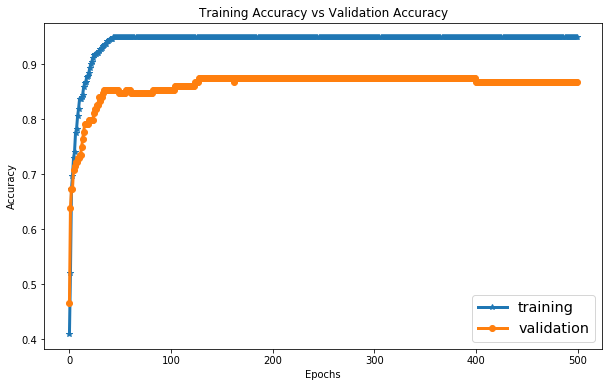

# Cough-analysis-for-COVID-19
# Dataset used:

ESC-50 cough samples [snaps](https://www.kaggle.com/kartikay99k/cough-detection) and [audio files](https://www.kaggle.com/mmoreaux/environmental-sound-classification-50)

# Work-Flow
# Audio processing part
1. We begin with loading the signals for mel-spectrogram and MFCC signal processing, refer [notebook](signal_processing.ipynb)
2. Use [Librosa](https://librosa.org/librosa/) file for performing Mel-spectrogram and MFCC processing

# Image part

**Libraries Used**
1. [Tensorflow libraries](https://tensorflow.org/)
2. Tensorflow image [classification](https://www.tensorflow.org/tutorials/images/classification)
3. Tensorflow pretrained model [MobileNet_V2](https://www.tensorflow.org/api_docs/python/tf/keras/applications/MobileNetV2)
4. Tensorflow Lite (Later stages)

# Required settings for optimal usage
1. GPU/TPU

# Data Visualizations

.png)

